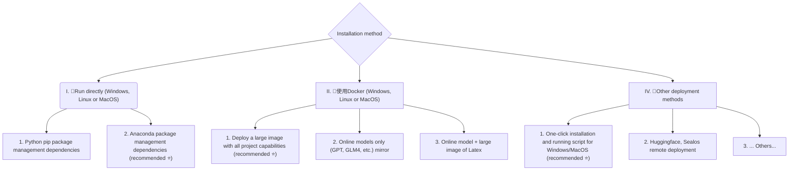
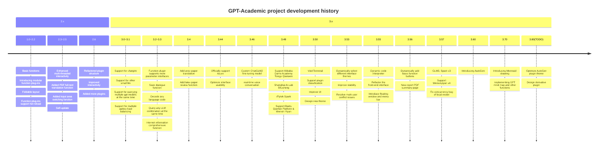

> [!IMPORTANT]
> 2024.10.10: Sudden power outage, the file server providing [whl package](https://drive.google.com/file/d/19U_hsLoMrjOlQSzYS3pzWX9fTzyusArP/view?usp=sharing) was urgently restored  
> 2024.10.8: Version 3.90 adds preliminary support for llama-index, and version 3.80 adds plugin secondary menu function (see wiki for details)  
> 2024.5.1: Added the function of Doc2x to translate PDF papers, [see details](https://github.com/binary-husky/gpt_academic/wiki/Doc2x)  
> 2024.3.11: Full support for Chinese large language models such as Qwen, GLM, DeepseekCoder! SoVits voice cloning module, [see details](https://www.bilibili.com/video/BV1Rp421S7tF/)
> 2024.1.17: When installing dependencies, please select the version specified in `requirements.txt`. Installation command: `pip install -r requirements.txt`. This project is completely open source and free. You can support the development of this project by subscribing to the [online service](https://github.com/binary-husky/gpt_academic/wiki/online).

<br>

<div align=center>
<h1 aligh="center">
 GPT Academic Optimization
</h1>

[![Github][Github-image]][Github-url]
[![License][License-image]][License-url]
[![Releases][Releases-image]][Releases-url]
[![Installation][Installation-image]][Installation-url]
[![Wiki][Wiki-image]][Wiki-url]
[![PR][PRs-image]][PRs-url]

[Github-image]: https://img.shields.io/badge/github-12100E.svg?style=flat-square
[License-image]: https://img.shields.io/github/license/binary-husky/gpt_academic?label=License&style=flat-square&color=orange
[Releases-image]: https://img.shields.io/github/release/binary-husky/gpt_academic?label=Release&style=flat-square&color=blue
[Installation-image]: https://img.shields.io/badge/dynamic/json?color=blue&url=https://raw.githubusercontent.com/binary-husky/gpt_academic/master/version&query=$.version&label=Installation&style=flat-square
[Wiki-image]: https://img.shields.io/badge/wiki-project-documentation-black?style=flat-square
[PRs-image]: https://img.shields.io/badge/PRs-welcome-pink?style=flat-square

[Github-url]: https://github.com/binary-husky/gpt_academic
[License-url]: https://github.com/binary-husky/gpt_academic/blob/master/LICENSE
[Releases-url]: https://github.com/binary-husky/gpt_academic/releases
[Installation-url]: https://github.com/binary-husky/gpt_academic#installation
[Wiki url]: https://github.com/binary-husky/gpt_academic/wiki
[PRs-url]: https://github.com/binary-husky/gpt_academic/pulls


</div>
<br>

**If you like this project, please give it a Star; if you have invented useful shortcuts or plug-ins, welcome to send pull requests! **

If you like this project, please give it a Star.
Read this in [English](docs/README.English.md) | [日本語](docs/README.Japanese.md) | [한국어](docs/README.Korean.md) | [Русский](docs/README.Russian.md) | [Français](docs/README.French.md). All translations have been provided by the project itself. To translate this project to arbitrary language with GPT, read and run [`multi_language.py`](multi_language.py) (experimental).
<br>

> [!NOTE]
> 1. The functions of each file in this project are described in detail in the [self-analysis report](https://github.com/binary-husky/gpt_academic/wiki/GPT-Academic Project Self-analysis Report)`self_analysis.md`. As the version is iterated, you can also click on the relevant function plug-in at any time to call GPT to regenerate the project's self-analysis report. Please refer to the wiki for common questions.
> [](#installation) [](https://github.com/binary-husky/gpt_academic/releases) [](https://github.com/binary-husky/gpt_academic/wiki/Project configuration instructions) []([https://github.com/binary-husky/gpt_academic/wiki/Project Configuration Instructions](https://github.com/binary-husky/gpt_academic/wiki))
>
> 2. This project is compatible with and encourages the use of domestic Chinese language base models such as Tongyi Qianwen, Zhipu GLM, etc. It supports the coexistence of multiple api-keys, which can be filled in the configuration file such as `API_KEY="openai-key1,openai-key2,azure-key3,api2d-key4"`. When you need to temporarily change `API_KEY`, enter the temporary `API_KEY` in the input area and press Enter to submit it to take effect.

<br><br>

<div align="center">

Features (⭐ = recently added features) | Description
--- | ---
⭐[Access to new model](https://github.com/binary-husky/gpt_academic/wiki/%E5%A6%82%E4%BD%95%E5%88%87%E6%8D%A2%E6%A8%A1%E5%9E%8B) | Baidu [Qianfan](https://cloud.baidu.com/doc/WENXINWORKSHOP/s/Nlks5zkzu) and Wenxin Yiyan, Tongyi Qianwen [Qwen](https://modelscope.cn/models/qwen/Qwen-7B-Chat/summary), Shanghai AI-Lab [Shusheng](https://github.com/InternLM/InternLM), iFlytek [Spark](https://xinghuo.xfyun.cn/), [LLaMa2](https://huggingface.co/meta-llama/Llama-2-7b-chat-hf), [Zhipu GLM4](https://open.bigmodel.cn/), DALLE3, [DeepseekCoder](https://coder.deepseek.com/)
⭐Support mermaid image rendering | Support GPT to generate [flowchart](https://www.bilibili.com/video/BV18c41147H9/), state transition diagram, Gantt chart, pie chart, GitGraph, etc. (version 3.7)
⭐Arxiv paper fine translation ([Docker](https://github.com/binary-husky/gpt_academic/pkgs/container/gpt_academic_with_latex)) | [Plugin] One-click [to translate arxiv papers with ultra-high quality](https://www.bilibili.com/video/BV1dz4y1v77A/), the best paper translation tool at present
⭐[Real-time voice dialogue input](https://github.com/binary-husky/gpt_academic/blob/master/docs/use_audio.md) | [Plugin] Asynchronous [audio monitoring](https://www.bilibili.com/video/BV1AV4y187Uy/), automatic sentence segmentation, automatic search for answering time
⭐AutoGen Multi-Agent Plugin | [Plugin] Explore the possibilities of multi-agent intelligence emergence with Microsoft AutoGen!
⭐Void Terminal Plugin | [Plugin] Ability to use natural language to directly schedule other plugins of this project
Proofreading, translation, code explanation | One-click polishing, translation, finding grammatical errors in papers, and code explanation
[Custom shortcut keys](https://www.bilibili.com/video/BV14s4y1E7jN) | Support custom shortcut keys
Modular design | Supports customized powerful [plugins](https://github.com/binary-husky/gpt_academic/tree/master/crazy_functions), plug-ins support [hot update](https://github.com/binary-husky/gpt_academic/wiki/%E5%87%BD%E6%95%B0%E6%8F%92%E4%BB%B6%E6%8C%87%E5%8D%97)
[Program Analysis](https://www.bilibili.com/video/BV1cj411A7VW) | [Plugin] One-click analysis of Python/C/C++/Java/Lua/... project tree or [Self-Analysis](https://www.bilibili.com/video/BV1cj411A7VW)
Read papers, [translate](https://www.bilibili.com/video/BV1KT411x7Wn) papers | [Plugin] One-click interpretation of latex/pdf full text and generation of abstracts
Latex full text [translation](https://www.bilibili.com/video/BV1nk4y1Y7Js/), [polishing](https://www.bilibili.com/video/BV1FT411H7c5/) | [Plugin] One-click translation or polishing of latex papers
Batch comment generation | [Plugin] Generate function comments in batches with one click
Markdown [Chinese-English Translation](https://www.bilibili.com/video/BV1yo4y157jV/) | [Plugin] Have you seen the [README](https://github.com/binary-husky/gpt_academic/blob/master/docs/README.English.md) in the above 5 languages? It was written by him
[PDF paper full text translation function](https://www.bilibili.com/video/BV1KT411x7Wn) | [Plugin] Extract title & abstract of PDF paper + translate the full text (multi-threaded)
[Arxiv Assistant](https://www.bilibili.com/video/BV1LM4y1279X) | [Plugin] Enter the arxiv article URL to translate the abstract + download the PDF in one click
One-click proofreading for Latex papers | [Plugin] Imitation of Grammarly to correct grammar and spelling errors in Latex articles + output comparison PDF
[Google Scholar Integration Assistant](https://www.bilibili.com/video/BV19L411U7ia) | [Plugin] Given any Google Scholar search page URL, let gpt help you [write relatedworks](https://www.bilibili.com/video/BV1GP411U7Az/)
Internet Information Aggregation + GPT | [Plugin] One-click [Let GPT get information from the Internet](https://www.bilibili.com/video/BV1om4y127ck) to answer questions and make information never outdated
Formula/image/table display | Can display the [tex form and rendering form](https://user-images.githubusercontent.com/96192199/230598842-1d7fcddd-815d-40ee-af60-baf488a199df.png) of the formula at the same time, support formula and code highlighting
Enable dark theme | Add /?__theme=dark to the end of the browser URL to switch to dark theme
[Multiple LLM models](https://www.bilibili.com/video/BV1wT411p7yf) support | It must be nice to be served by GPT3.5, GPT4, [Tsinghua ChatGLM2](https://github.com/THUDM/ChatGLM2-6B), and [Fudan MOSS](https://github.com/OpenLMLab/MOSS) at the same time, right?
More LLM models are connected, support [huggingface deployment](https://huggingface.co/spaces/qingxu98/gpt-academic) | Add Newbing interface (New Bing), introduce Tsinghua [Jittorllms](https://github.com/Jittor/JittorLLMs) to support [LLaMA](https://github.com/facebookresearch/llama) and [Pangu α](https://openi.org.cn/pangu/)
⭐[void-terminal](https://github.com/binary-husky/void-terminal) pip package | Without GUI, call all function plugins of this project directly in Python (under development)
More new features (image generation, etc.) ... | See the end of this document...
</div>


- New interface (modify the LAYOUT option in `config.py` to switch between "left-right layout" and "top-bottom layout")
<div align="center">

</div>

<div align="center">

</div>


- All buttons are dynamically generated by reading functional.py, you can add custom functions at will to free up the clipboard
<div align="center">

</div>

- Editing/Correction
<div align="center">

</div>

- If the output contains formulas, it will be displayed in both tex and rendered form for easy copying and reading
<div align="center">

</div>

- Too lazy to read the project code? Just show the whole project to ChatGPT
<div align="center">

</div>

- Mixed calls of multiple large language models (ChatGLM + OpenAI-GPT3.5 + GPT4)
<div align="center">

</div>

<br><br>

# Installation



### Installation Method I: Direct Run (Windows, Linux or MacOS)

1. Download the project

    ```sh
    git clone --depth=1 https://github.com/binary-husky/gpt_academic.git
    cd gpt_academic
    ```

2. Configure variables such as API_KEY

    In `config.py`, configure variables such as API KEY. [Special network environment setting method](https://github.com/binary-husky/gpt_academic/issues/1), [Wiki-Project configuration instructions](https://github.com/binary-husky/gpt_academic/wiki/Project configuration instructions).

    "The program will first check whether there is a private configuration file named `config_private.py`, and use the configuration in it to overwrite the configuration of the same name in `config.py`. If you can understand the above reading logic, we strongly recommend that you create a new configuration file named `config_private.py` in the same path as `config.py`, and use `config_private.py` to configure the project to ensure that the configuration is not lost during automatic updates."

    "Supports configuring projects through `environment variables`. The writing format of environment variables refers to the `docker-compose.yml` file or our [Wiki page](https://github.com/binary-husky/gpt_academic/wiki/Project Configuration Instructions). Configuration reading priority: `environment variables` > `config_private.py` > `config.py`".


3. Install dependencies
    ```sh
    # (Select I: If you are familiar with Python, Python version 3.9 ~ 3.11 is recommended) Note: Use the official pip source or Alibaba pip source. Temporary source change method: python -m pip install -r requirements.txt -i https://mirrors.aliyun.com/pypi/simple/
    python -m pip install -r requirements.txt

    # (Option II: Using Anaconda) The steps are similar (https://www.bilibili.com/video/BV1rc411W7Dr):
    conda create -n gptac_venv python=3.11 # Create anaconda environment
    conda activate gptac_venv # Activate anaconda environment
    python -m pip install -r requirements.txt # This step is the same as pip installation
    ```


<details><summary>If you need to support Tsinghua ChatGLM2/Fudan MOSS/RWKV as the backend, please click here to expand</summary>
<p>

[Optional step] If you need to support Tsinghua ChatGLM3/Fudan MOSS as the backend, you need to install more dependencies (prerequisites: familiar with Python + used Pytorch + computer configuration is strong enough):

```sh
# [Optional Step I] Support Tsinghua ChatGLM3. Tsinghua ChatGLM Note: If you encounter the error "Call ChatGLM fail cannot load ChatGLM parameters normally", refer to the following: 1: The above default installation is the torch+cpu version. If you use cuda, you need to uninstall torch and reinstall torch+cuda; 2: If the model cannot be loaded due to insufficient local configuration, you can modify the model accuracy in request_llm/bridge_chatglm.py, and change AutoTokenizer.from_pretrained("THUDM/chatglm-6b", trust_remote_code=True) to AutoTokenizer.from_pretrained("THUDM/chatglm-6b-int4", trust_remote_code=True)
python -m pip install -r request_llms/requirements_chatglm.txt

# [Optional Step II] Support Fudan MOSS
python -m pip install -r request_llms/requirements_moss.txt
git clone --depth=1 https://github.com/OpenLMLab/MOSS.git request_llms/moss # Note that when executing this line of code, you must be in the project root path

# [Optional Step III] Support RWKV Runner
Home wiki: https://github.com/binary-husky/gpt_academic/wiki/%E9%80%82%E9%85%8DRWKV-Runner

# [Optional Step IV] Make sure that the AVAIL_LLM_MODELS in the config.py configuration file contains the desired model. Currently supported models are as follows (the jittorllms series currently only supports the docker solution):
AVAIL_LLM_MODELS = ["gpt-3.5-turbo", "api2d-gpt-3.5-turbo", "gpt-4", "api2d-gpt-4", "chatglm", "moss"] # + ["jittorllms_rwkv", "jittorllms_pangualpha", "jittorllms_llama"]

# [Optional step V] Support local model INT8, INT4 quantization (the model itself is not a quantized version, currently supported by deepseek-coder, more model quantization options will be added after testing)
pip install bitsandbyte
# Windows users need to use the following bitsandbytes-windows-webui to install bitsandbytes
python -m pip install bitsandbytes --prefer-binary --extra-index-url=https://jllllll.github.io/bitsandbytes-windows-webui
pip install -U git+https://github.com/huggingface/transformers.git
pip install -U git+https://github.com/huggingface/accelerate.git
pip install peft
```

</p>
</details>


4. Run
    ```sh
    python main.py
    ```

### Installation Method II: Using Docker

0. Deploy the full capabilities of the project (this is a large image that includes cuda and latex. However, if you have a slow network and a small hard disk, this method is not recommended for deploying the complete project)
[](https://github.com/binary-husky/gpt_academic/actions/workflows/build-with-all-capacity.yml)

    ``` sh
    # Modify docker-compose.yml, keep solution 0 and delete other solutions. Then run:
    docker-compose up
    ```

1. Only online models such as ChatGPT + GLM4 + Wenxinyiyan + spark (recommended for most people)
[](https://github.com/binary-husky/gpt_academic/actions/workflows/build-without-local-llms.yml)
[](https://github.com/binary-husky/gpt_academic/actions/workflows/build-with-latex.yml)
[](https://github.com/binary-husky/gpt_academic/actions/workflows/build-with-audio-assistant.yml)

    ``` sh
    # Modify docker-compose.yml, keep solution 1 and delete other solutions. Then run:
    docker-compose up
    ```

PS If you need to rely on Latex plug-in functions, please see Wiki. In addition, you can also directly use Solution 4 or Solution 0 to obtain Latex functions.

2. ChatGPT + GLM3 + MOSS + LLAMA2 + Tongyi Qianwen (requires familiarity with the [Nvidia Docker](https://docs.nvidia.com/datacenter/cloud-native/container-toolkit/install-guide.html#installing-on-ubuntu-and-debian) runtime)
[](https://github.com/binary-husky/gpt_academic/actions/workflows/build-with-chatglm.yml)

    ``` sh
    # Modify docker-compose.yml, keep solution 2 and delete other solutions. Then run:
    docker-compose up
    ```


### Installation Method III: Other Deployment Methods
1. **Windows one-click script**.
Windows users who are completely unfamiliar with the Python environment can download the one-click script released in [Release](https://github.com/binary-husky/gpt_academic/releases) to install the version without a local model. Script contribution source: [oobabooga](https://github.com/oobabooga/one-click-installers).

2. Use third-party APIs, Azure, Wenxinyiyan, Spark, etc. See [Wiki page](https://github.com/binary-husky/gpt_academic/wiki/Project configuration instructions)

3. A guide to avoiding pitfalls when deploying cloud servers remotely.
Please visit [Cloud Server Remote Deployment Wiki](https://github.com/binary-husky/gpt_academic/wiki/%E4%BA%91%E6%9C%8D%E5%8A%A1%E5%99%A8%E8%BF%9C%E7%A8%8B%E9%83%A8%E7%BD%B2%E6%8C%87%E5%8D%97)

4. Deployment on other platforms & secondary website deployment
    - Use Sealos [one-click deployment](https://github.com/binary-husky/gpt_academic/issues/993).
    - Use WSL2 (Windows Subsystem for Linux). Please visit [deployment wiki-2](https://github.com/binary-husky/gpt_academic/wiki/%E4%BD%BF%E7%94%A8WSL2%EF%BC%88Windows-Subsystem-for-Linux-%E5%AD%90%E7%B3%BB%E7%BB%9F%EF%BC%89%E9%83%A8%E7%BD%B2)
    - How to run under a secondary URL (such as `http://localhost/subpath`). Please visit [FastAPI running instructions](docs/WithFastapi.md)

<br><br>

# Advanced Usage
### I: Customize new shortcut buttons (academic shortcut keys)

Now you can add new convenience buttons through the Customize Menu in the Appearance menu in the UI. If you need to define it in code, open core_functional.py with any text editor and add the following entry:

```python
"Super English to Chinese": {
    # prefix, which will be added before your input. For example, it can be used to describe your requirements, such as translation, code interpretation, polishing, etc.
    "Prefix": "Please translate the following content into Chinese, and then use a markdown table to explain the proper nouns that appear in the text one by one:\n\n",

    # Suffix, which will be added after your input. For example, it can be used with the prefix to enclose your input in quotes.
    "Suffix": "",
},
```

<div align="center">

</div>

### II: Custom Function Plugin
Write powerful function plugins to perform any task you can think of or even imagine.
The plug-in writing and debugging of this project is very easy. As long as you have some basic knowledge of Python, you can implement your own plug-in functions by imitating the template we provide.
For more details, please refer to the [Function Plugin Guide](https://github.com/binary-husky/gpt_academic/wiki/%E5%87%BD%E6%95%B0%E6%8F%92%E4%BB%B6%E6%8C%87%E5%8D%97).

<br><br>

# Updates
### I: Dynamic

1. Conversation saving function. Call `Save current conversation` in the function plug-in area to save the current conversation as a readable + restorable html file.
In addition, you can call `Load conversation history archive` in the function plug-in area (drop-down menu) to restore the previous session.
Tip: Click `Load Conversation History Archive` without specifying a file to view the historical HTML archive cache.
<div align="center">

</div>

2. ⭐Latex/Arxiv paper translation function⭐
<div align="center">
 ===>

</div>

3. Void Terminal (understand user intent from natural language input + automatically call other plug-ins)

- Step 1: Enter "Please call the plug-in to translate the PDF paper, the address is https://openreview.net/pdf?id=rJl0r3R9KX"
- Step 2: Click on "Void Terminal"

<div align="center">

</div>

4. Modular functional design, simple interface but powerful functions
<div align="center">


</div>

5. Decode other open source projects
<div align="center">


</div>

6. Small functions to decorate [live2d](https://github.com/fghrsh/live2d_demo) (disabled by default, need to modify `config.py`)
<div align="center">

</div>

7. OpenAI Image Generation
<div align="center">

</div>

8. Drawing flow charts and mind maps based on mermaid
<div align="center">

</div>

9. Latex full text proofreading and error correction
<div align="center">
 ===>

</div>

10. Language and theme switching
<div align="center">

</div>


### II: Version:
- version 3.80(TODO): Optimize the AutoGen plugin theme and design a series of derivative plugins
- version 3.70: Introduced Mermaid drawing, implemented GPT mind map and other functions   
- version 3.60: Introducing AutoGen as the cornerstone of the new generation of plugins
- version 3.57: Support GLM3, Spark v3, Wenxinyiyan v4, fix the concurrency BUG of local model
- version 3.56: Support dynamic addition of basic function buttons, new report PDF summary page
- version 3.55: Refactor the front-end interface and introduce floating windows and menu bars
- version 3.54: Added dynamic code interpreter (Code Interpreter) (to be improved)
- version 3.53: Support dynamic selection of different interface themes, improve stability & solve multi-user conflict issues
- version 3.50: Use natural language to call all function plugins of this project (Void Terminal), support plugin classification, improve UI, and design new themes
- version 3.49: Support Baidu Qianfan platform and Wenxin Yiyan
- version 3.48: Support Alibaba Damo Academy Tongyi Qianwen, Shanghai AI-Lab Shusheng, iFlytek Spark
- version 3.46: Supports real-time voice conversation with full hands-free operation
- version 3.45: Support custom ChatGLM2 fine-tuning model
- version 3.44: officially supports Azure and optimizes the interface usability
- version 3.4: +arxiv paper translation, latex paper correction function
- version 3.3: +Internet information comprehensive function
- version 3.2: Function plugin supports more parameter interfaces (save dialogue function, decode any language code + query any LLM combination at the same time)
- version 3.1: Support querying multiple gpt models at the same time! Support api2d, support multiple apikey load balancing
- version 3.0: support for chatglm and other small llm
- version 2.6: Refactored the plugin structure, improved interactivity, and added more plugins
- version 2.5: self-update, solve the problem of text being too long and token overflow when summarizing the source code of a large project
- version 2.4: Added PDF full text translation function; Added input area switching function
- version 2.3: Enhanced multi-threaded interactivity
- version 2.2: Function plugin supports hot reload
- version 2.1: Foldable layout
- version 2.0: Introducing modular function plugins
- version 1.0: basic functions

GPT Academic developer QQ group: `610599535`

- Known Issues
    - Some browser translation plugins interfere with the operation of this software front end
    - The official Gradio currently has many compatibility issues, please **make sure to use `requirement.txt` to install Gradio**




### III: Theme
You can change the theme by modifying the `THEME` option (config.py)
1. `Chuanhu-Small-and-Beautiful` [URL](https://github.com/GaiZhenbiao/ChuanhuChatGPT/)


### IV: Development branch of this project

1. `master` branch: main branch, stable version
2. `frontier` branch: development branch, testing version
3. How to [connect to other large models](request_llms/README.md)
4. Visit GPT-Academic's [online service and support us](https://github.com/binary-husky/gpt_academic/wiki/online)

### V: Reference and Learning

```
The code refers to the designs of many other excellent projects, in no particular order:

# Tsinghua ChatGLM2-6B:
https://github.com/THUDM/ChatGLM2-6B

# Tsinghua JittorLLMs:
https://github.com/Jittor/JittorLLMs

#ChatPaper:
https://github.com/kaixindelele/ChatPaper

# Edge-GPT:
https://github.com/acheong08/EdgeGPT

# ChuanhuChatGPT:
https://github.com/GaiZhenbiao/ChuanhuChatGPT

# Oobabooga one-click installer:
https://github.com/oobabooga/one-click-installers

# More：
https://github.com/gradio-app/gradio
https://github.com/fghrsh/live2d_demo
```
